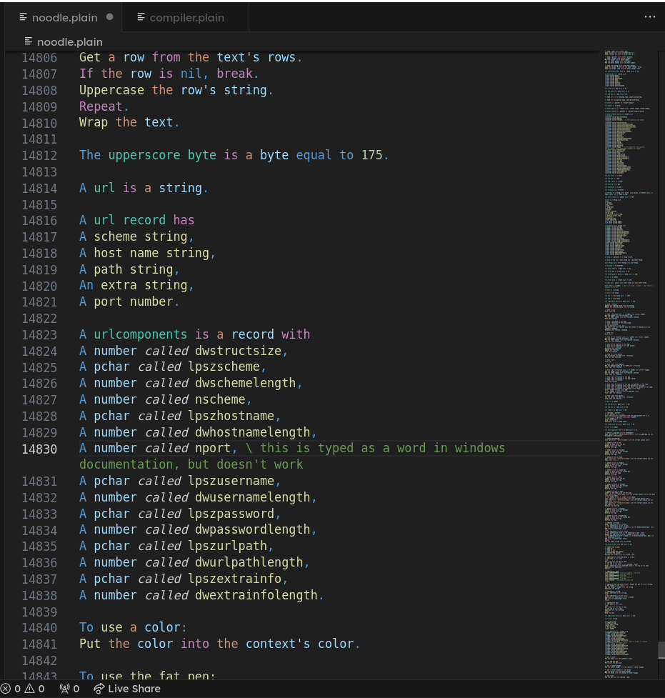
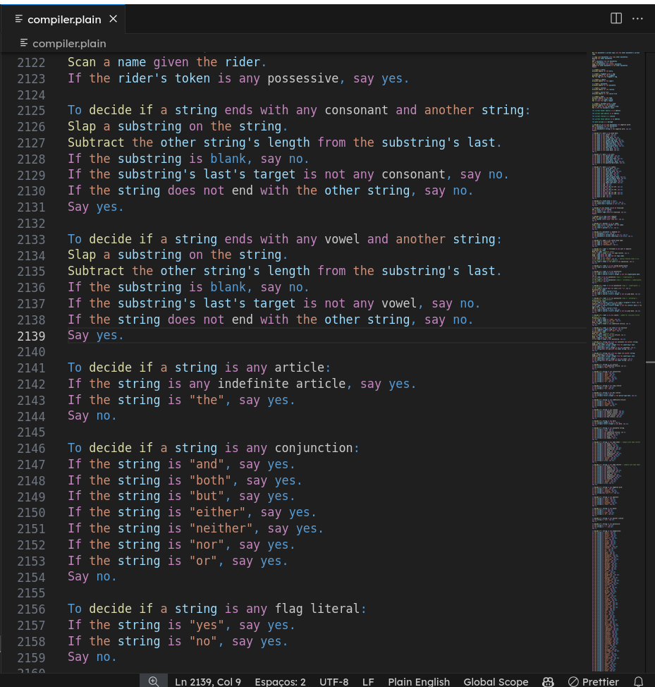

# Plain English Syntax Highlighting for Visual Studio Code

## Description

This Visual Studio Code extension provides syntax highlighting for the Plain English language, allowing users to write and edit Plain English code with ease directly within the editor.

Plain English is a domain-specific language designed for ease of understanding and readability, created by [Gerry Rzeppa](https://www.quora.com/profile/Gerry-Rzeppa) and Dan Rzeppa. For more information about Plain English, visit the [official project website](http://osmosian.com/cal-4700.zip).

## Features

- Syntax highlighting for Plain English language files *(.plain",".pe",".plainenglish",".plain-english","plain_english")*
- Improved readability and clarity for Plain English code within Visual Studio Code
- Seamless integration with other VS Code features and extensions

## Installation

You can install the Plain English Syntax Highlighting extension directly from the Visual Studio Code Marketplace or by searching for "Plain English" in the Extensions view (Ctrl+Shift+X).

## Usage

Once installed, the extension automatically applies syntax highlighting to any files with the extensions listed above. Simply open a Plain English file in Visual Studio Code to see the syntax highlighting in action.

## Support and Feedback

For support or feedback regarding this extension, please contact us at [help@osmosian.com](mailto:help@osmosian.com). We welcome any suggestions, bug reports, or feature requests.

## Additional Resources

- [Plain English Programming Blog](https://osmosianplainenglishprogramming.blog/): Stay updated with the latest news, tutorials, and articles related to Plain English programming.
[Rosetta Code](https://rosettacode.org/wiki/Category:Plain_English)

---

